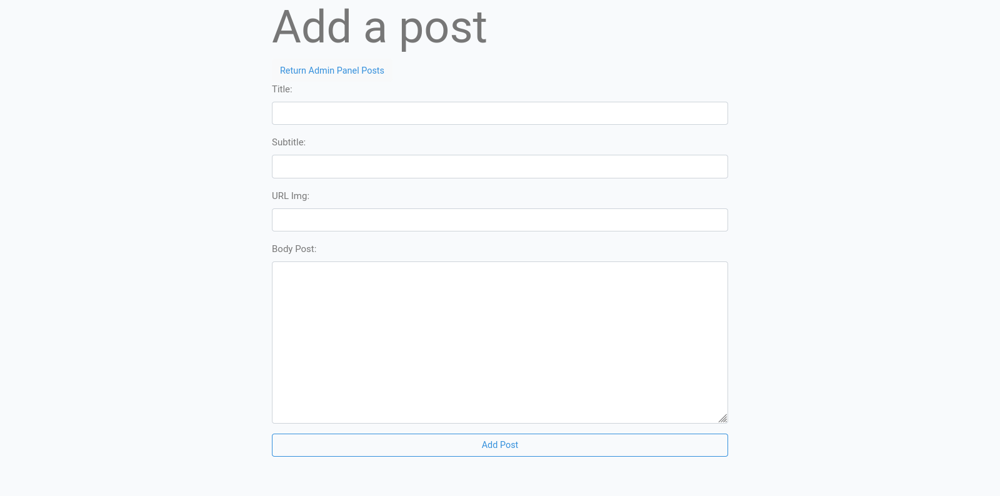
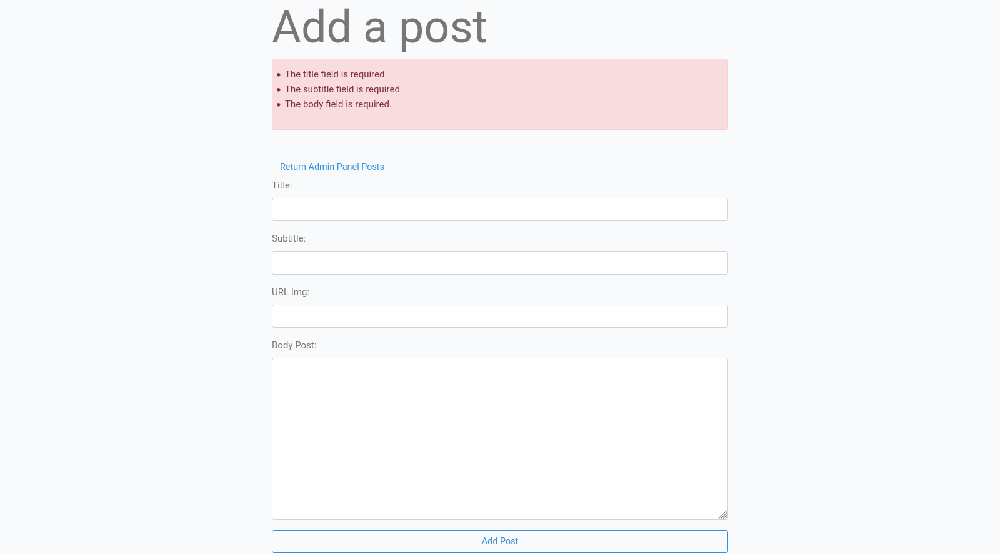
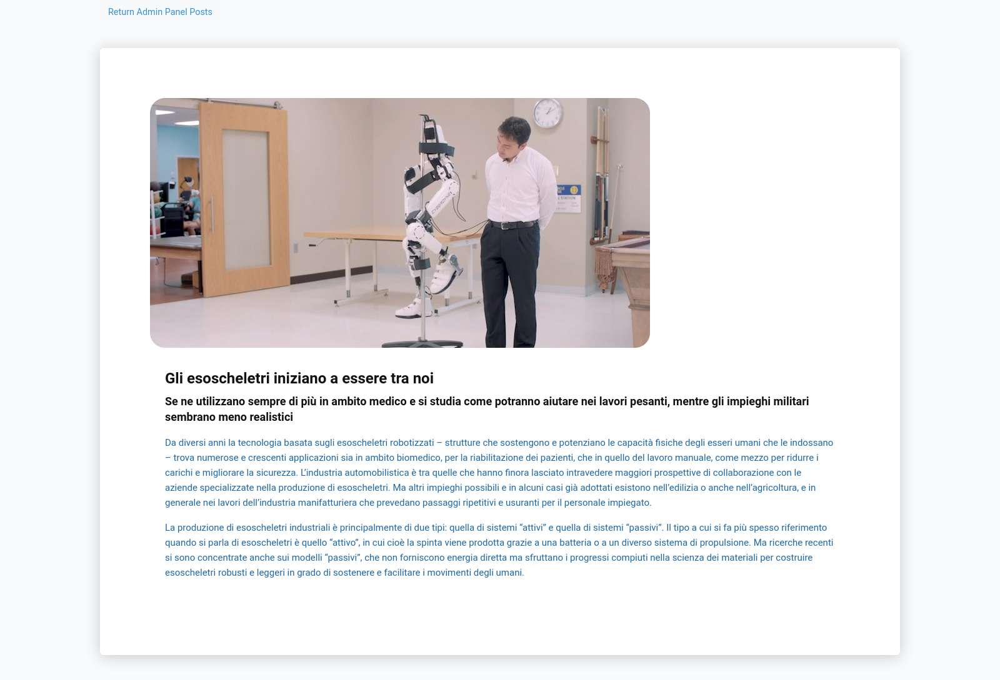
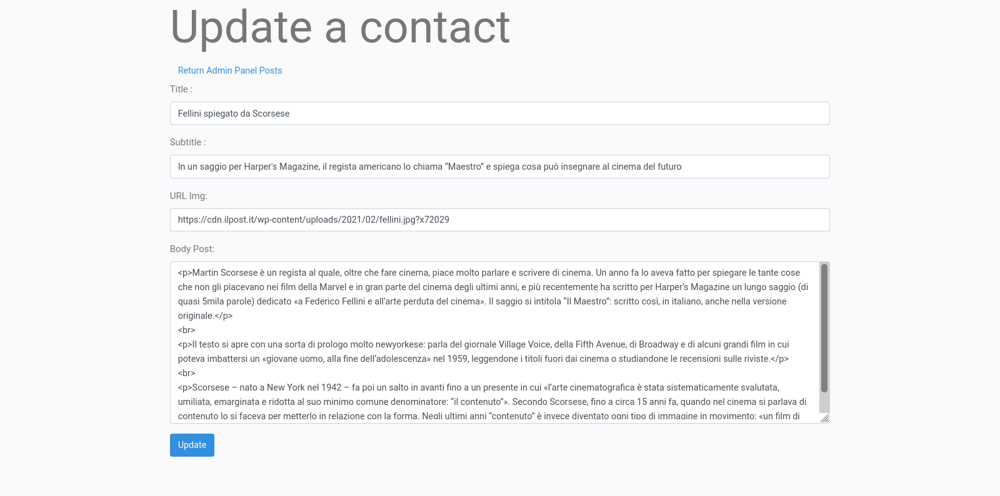
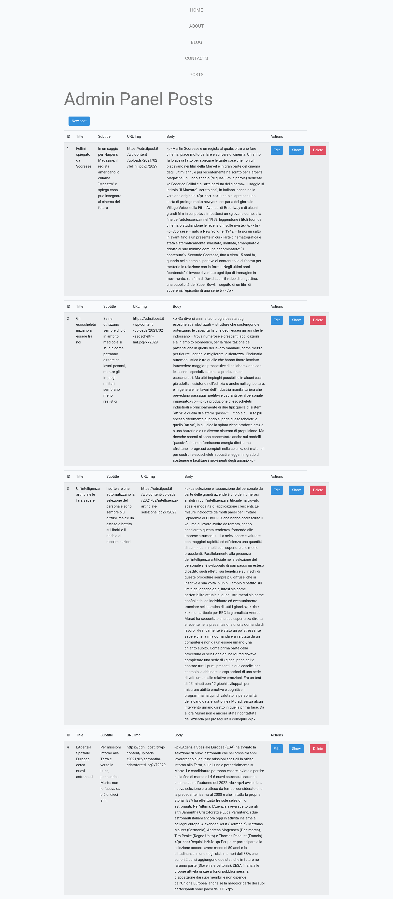

# Creare una CRUD completa che crei, visualizzi, modifichi e cancelli dei post

## Cos'è una CRUD ?

CRUD sta per Create, Read, Update e Delete - ovvero le operazini necessarie nella maggior parte delle app basate sulla manipolazione di dati allocati in un database, (accesso e manipolazione).

In questa applicazione a tal proposito ci serviremo del supporto di Laravel 7 ed un DB MySQL.

## Creiamo un database in MySQL - direttamente da terminale

Creiamo ora un database MySQL che useremo per inserire i dati nella nostra applicazione Laravel. Nel terminale, richiamiamo il client mysql con:

`$ mysql -u root -p` e diamo invio -  **root** è il nostro utente di login e **-p** ci permetterà di inserire la nostra password in modo criptato (non visibile)

Ci comparira un prompt per l'inserimento della password che è quella impostata quando abbiamo installato il server MySQL - e.s. nel caso di MAMP potrebbe esser **rout**

A questo punto possiamo eseguire le istruzioni per creare il nostro database ed assegnargli un nome.

`mysql> CREATE DATABASE laravel_blog;` invio.
`mysql> show databases;` ci permette di verificare la creazione del database mostrandoci i database contenuti nel server mysql.

`mysql> exit;` ci permette di uscire dal server mysql.

Ora andiamo in laravel ed apriamo il file **.env** per poterlo aggiornare con le credenziali necessari a far si che il nostro framework possa aver accesso al server MySQL:

      DB_CONNECTION=mysql
      DB_HOST=127.0.0.1
      DB_PORT=3306 // questa sarà la porta a cui è collegato il nostro server - verificarla
      DB_DATABASE=laravel_blog
      DB_USERNAME=root
      DB_PASSWORD=root 

## Creiamo il nostro primo Model di laravel

Laravel usa il modello MVC per organizzare l'applicazione in tre porzioni separate ma comunicanti tra loro, M - Model, V - View, C - Controller.

>*"E' un pattern architettonico comunemente utilizzato per lo sviluppo di interfacce utente che divide un'applicazione in tre parti interconnesse. Questo viene fatto per separare le rappresentazioni interne delle informazioni dai modi in cui le informazioni vengono presentate e accettate dall'utente."* [Wikipedia](https://en.wikipedia.org/wiki/Model%E2%80%93view%E2%80%93controller "Wikipedia")

- ***Il Model - incapsula il layer di accesso ai dati***

- ***La View - contiente il layer di rappresentazione***

- ***Il Controller - contiene il codice per controllare l'applicazione e comunica con il Model e le Views***

### Passiamo alla creazione del Model Laravel -

Da terminale diamo l'istruzione :

`$ php artisan make:model Post --migration` invio;

Questo ci permetterà di creare un modello di *post* e un file di *migrazione*. Nel terminale, otteniamo un output simile a:

    Model created successfully.
    Created Migration: 2021_02_19_143840_create_posts_table

Apriamo il file di migrazione appena creato (`app/Http/databasemigrations/2021_02_19_143840_create_posts_table`) ed andiamo ad aggiornarlo con :

    <?php

      use Illuminate\Support\Facades\Schema;
      use Illuminate\Database\Schema\Blueprint;
      use Illuminate\Database\Migrations\Migration;

      class CreatePostsTable extends Migration
      {
          /**
          * Run the migrations.
          *
          * @return void
          */
          public function up()
          {
              Schema::create('posts', function (Blueprint $table) {
                  $table->id();
                  $table->string('title');
                  $table->string('subtitle');
                  $table->string('img');
                  $table->text('body');
                  $table->timestamps();            
              });
          }

          /**
          * Reverse the migrations.
          *
          * @return void
          */
          public function down()
          {
              Schema::dropIfExists('posts');
          }
      }

In questo modo andremo ad aggiungere nella tabella `posts` i campi - colonne - appena definiti:

  id|created_at|updated_at|title|subtitle|img|body
  --|----------|----------|-----|--------|---|----

Ora con l'istruzione `$ php artisan migrate` andiamo a migrare/creare la nostra tabella nel nostro database *`laravel_blog`* allocato sul server MySQL.

Ora, diamo un'occhiata al nostro modello di *post*, che verrà utilizzato per interagire con la tabella del database dei *posts*.

Apriamo app / Post.php e lo aggiorniamo:

    <?php

    namespace App;

    use Illuminate\Database\Eloquent\Model;

    class Post extends Model
    {
        protected $fillable = [
        'title',
        'subtitle',
        'img',
        'body'     
      ];
    }

>*Assegnazione di massa e colonne JSON*
*Quando si assegnano colonne JSON, la chiave assegnabile di massa di ciascuna colonna deve essere specificata nell'array `$fillable` compilabile del modello. Per sicurezza, Laravel non supporta l'aggiornamento degli attributi JSON nidificati quando si utilizza la proprietà `guarded`...* [Laravel Eloquent](https://laravel.com/docs/7.x/eloquent##mass-assignment)

## Creiamo il Controller e la Route

Dopo aver creato il modello e migrato il nostro database. Creiamo ora il controller e le route per lavorare con il modello Post.

Da terminale, eseguiamo il l'istruzion:

`$ php artisan make:controller PostController --resource`

>Il routing delle risorse Laravel assegna i tipici percorsi 'CRUD' a un controller con una singola riga di codice.
Ad esempio, si potrebbe voler creare un controller che gestisca tutte le richieste HTTP per le 'foto' archiviate dall'applicazione. Utilizzando il comando `make: controller` Artisan creerà rapidamente un controller di questo tipo:
`$ php artisan make:controller PhotoController --resource`
Questo comando genererà un controller in app / Http / Controllers / PhotoController.php. Il controller conterrà un metodo per ciascuna delle operazioni sulle risorse disponibili. [Laravel Resource Controllers](https://laravel.com/docs/7.x/controllers#resource-controllers "Resource Controllers")

Apriamo *app/Http/Controllers/PostController.php* file.

      <?php

        namespace App\Http\Controllers;

        use Illuminate\Http\Request;

        class PostController extends Controller
        {
            /**
            * Display a listing of the resource.
            *
            * @return \Illuminate\Http\Response
            */
            public function index()
            {
                //
            }

            /**
            * Show the form for creating a new resource.
            *
            * @return \Illuminate\Http\Response
            */
            public function create()
            {
                //
            }

            /**
            * Store a newly created resource in storage.
            *
            * @param  \Illuminate\Http\Request  $request
            * @return \Illuminate\Http\Response
            */
            public function store(Request $request)
            {
                //
            }

            /**
            * Display the specified resource.
            *
            * @param  int  $id
            * @return \Illuminate\Http\Response
            */
            public function show($id)
            {
                //
            }

            /**
            * Show the form for editing the specified resource.
            *
            * @param  int  $id
            * @return \Illuminate\Http\Response
            */
            public function edit($id)
            {
                //
            }

            /**
            * Update the specified resource in storage.
            *
            * @param  \Illuminate\Http\Request  $request
            * @param  int  $id
            * @return \Illuminate\Http\Response
            */
            public function update(Request $request, $id)
            {
                //
            }

            /**
            * Remove the specified resource from storage.
            *
            * @param  int  $id
            * @return \Illuminate\Http\Response
            */
            public function destroy($id)
            {
                //
            }
        }

La classe PostController estende la classe Controller disponibile da Laravel e definisce un gruppo di metodi che verranno utilizzati per eseguire le operazioni CRUD sul modello Post.

- Ogni metodo nella parte commentata spiega brevemente di cosa si occupa.

Prima di formire ulteriori implementazioni ai metodi CRUD andiamo ad aggiungere "*il routing"*.
Apriamo il file routes / web.php e aggiornalo con:

`Route::resource('posts', 'PostController');`

Utilizzando il metodo *statico* `resource()` di `Route`, è possibile creare più rotte per esporre più azioni sulla risorsa.

Queste rotte sono *mappate* da vari metodi PostController, che dovranno essere implementati.

<!-- Per aver un'idea globale possiamo dare il comando da terminale `$ php artisan route:list` -->

      GET/posts, mappato dal metodo index(),
      GET /posts/create, mappato dal metodo create(),
      POST /posts, mappato dal metodo store(),
      GET /posts/{contact}, mappato dal metodo show(),
      GET /posts/{contact}/edit, mappato dal metodo edit(),
      PUT/PATCH /posts/{contact}, mappato dal metodo update(),
      DELETE /posts/{contact}, mappato dal metodo destroy().

<!-- Queste route vengono utilizzate per servire modelli HTML e anche come endpoint API per lavorare con il modello Post.

`Route::apiResource('posts', 'PostController');` -->

## Implementazione dei metodi CRUD

Implementiamo ora i metodi del controller insieme alle views

### C: implementazione dell'operazione di creazione e aggiunta di un modulo

`PostController` include il metodo `store()` che mappa all'endpoint POST / contatti che verrà utilizzato per creare un contatto nel database e il `create ()` che mappa al percorso GET / contatti / create che verrà utilizzato per servire il Modulo HTML utilizzato per inviare il contatto all'endpoint POST / contatti.

Andiamo nel `PostController.php` - `app/Http/Controllers/PostController.php` ed importiamo il model `Post`

`use App\Post;`

Quindi, individua il metodo `store ()` (che ci permette di archivia, una risorsa appena creata, nel database) e compiliamolo:

    public function store(Request $request)
    {

        //elementi di validazione necessari
        $request->validate([
            'title'=>'required',
            'subtitle'=>'required',
            'body'=>'required'
        ]);
        //Qui creeremo il nostro Post
        $post = new Post([
            'title' => $request->get('title'),
            //equivalente di 'title' => request('title')

            'subtitle' => $request->get('subtitle'),
            'img' => $request->get('img'),
            'body' => $request->get('body')
        ]);
        //andiamo a salvare la risorsa appena creata
        $post->save();
        return redirect('/posts')->with('success', 'Post saved!');
    }

Andiamo a dire al metodo `create()` dove reindirizzare troveremo il form che ci permetterà di *creare* la nuova risorsa/post

    public function create()
        {
            return view('posts.create');
        }

La funzione `create ()` utilizza il metodo `view ()` per restituire il template `create.blade.php` che deve essere presente nella cartella `resources/views/posts`.

Prima di creare il template `create.blade.php` si è creato un template di base che verrà esteso al template create e da tutti gli altri template che verranno creati per gestire il pannello dei posts.

Nella cartella `resources/views/posts` , creiamo quindi il  `base.blade.php`:
<!-- $ cd resources/views
    $ mkdir posts
    $ cd posts
    $ touch base.blade.php -->
        <!DOCTYPE html>
        <html lang="en">
            @include('layout.head')
            <body>
                @yield('header')
                

                    @yield('main')
                

                
            </body>
        </html>

Ora andiamo a strutturare il `create.blade.php`

        @extends('posts.base')
        @section('site-title')
            Arch Blog
        @endsection

        @section('page-title')
            Post Creation Panel
        @endsection

        @section('main')
        

        

            <h1 class="display-3">Add a post</h1>
        

            @if ($errors->any())
            

                <ul>
                    @foreach ($errors->all() as $error)
                    <li>{{ $error }}</li>
                    @endforeach
                </ul>
            
 
            @endif
            <form method="post" action="{{ route('posts.store') }}">
                @csrf
                
    
                    <label for="title">Title:</label>
                    <input type="text" class="form-control" name="title"/>
                

                

                    <label for="subtitle">Subtitle:</label>
                    <input type="text" class="form-control" name="subtitle"/>
                

                

                    <label for="img">URL Img:</label>
                    <input type="text" class="form-control" name="img"/>
                

                

                    <label for="body">Body Post:</label>
                    <textarea class="form-control" name="body" cols="50" rows="10"></textarea>
                

                <button type="submit" class="btn btn-outline-primary btn-block"">Add Post</button>
            </form>
        

        

        

        @endsection

### R: Read - implementazione dell'operazione show

Ora tornando nel controller `PostController.php` - `app/Http/Controllers/PostController.php`, implementeremo l'operazione di `show` dei dati compilando l'omonimo metodo `show()`:

    public function show($id)
        {
            //
            $post = Post::find($id);

            return view('posts.show', compact('post'));
        }

La funzione `show ()` utilizza il metodo `view ()` per restituire il template `show.blade.php` che deve essere presente nella cartella `resources/views/posts`.

Ora andiamo a strutturare il file `show.blade.php` che al suo interno avrà la struttura della singola *blog-card*, che grazie al parametro $id dichiarato nel metodo `show()` e poi richiamato nel metodo `Post::find($id)`, ci restituira i dadi associati a quel singolo elemento in database associato a quell' **id**

    

        <article class="blog-card">
            img}}"/>
            

            <h2 class="post-title">{{$post->title}}</h2>
            <h3 class="post-subtitle"><?php echo " {$post->subtitle}" ;?></h3>
            
<?php echo " {$post->body}" ;?>

            

            <!-- /.article-details -->
        </article>
    

### U: implementazione dell'operazione di update

Ora tornando nel controller `PostController.php` - `app/Http/Controllers/PostController.php`, implementeremo l'operazione di `update` dei dati compilando i metodi `edit` e `update`:

        public function edit($id)
        {
            //
            $post = Post::find($id);
            return view('posts.edit', compact('post')); 
        }

        public function update(Request $request, $id)
        {
            //
            $request->validate([
                'title'=>'required',
                'subtitle'=>'required',
                'body'=>'required'
            ]);

            $post = Post::find($id);
            $post->title = request('title');
            $post->subtitle = request('subtitle');
            $post->img = request('img');
            $post->body = request('body');
            $post->save();
            return redirect('/posts')->with('success', 'Post saved!');
        }

### D: implementazione dell'operazione di eliminazione

Compilando il metodo `destroy()` eseguiremo l'operazione di eliminazione del dato, in particolare possiamo effettuare sia un ***hard delete*** che un ***soft delete*** come da documentazione [Laravel Eloquent#deleting-models](https://laravel.com/docs/8.x/eloquent#deleting-models "#deleting-models")

        public function destroy($id)
        {
            $post = Post::find($id);
            $post->delete();

            return redirect('/posts')->with('success', 'Post deleted!');
        }

Quanto reindirizzo alla route `/posts`nei metodi CRUD, passiamo anche un messaggio di successo `succes`, ma non viene visualizzato nel nostro `index`.

Per poterlo visualizzare in caso di buona riuscita, nel file `index` aggiungiamo la sezione:

        

            @if(session()->get('success'))
                

                {{ session()->get('success') }}  
                

            @endif
        

### Admin Panel Post

